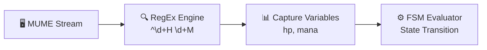
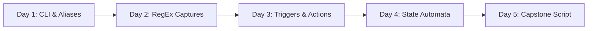

  

# 💻 STEM & Computer Science Curriculum Track

  
    🏷️ AP CSP: AAP-1, AAP-2, AAP-3, CRD-2
  
  
    🏷️ CSTA: 3A-AP-16, 3B-AP-14, 3B-AP-15
  
  
    🏷️ College CS: CS101 / CS201 / Data Structures
  

Welcome to the **MUME Computer Science Curriculum Track**. Text-based MUDs are ideal active-learning sandboxes for teaching fundamental computing concepts—from command-line parameter parsing to regular expression pattern matching, finite state automata, and graph pathfinding algorithms.

This track maps directly to national learning standards including **AP Computer Science Principles (AP CSP)**, **CSTA K-12 Computer Science Standards**, and **Introductory College CS (CS101 / CS201)**.

---

## 📅 Curriculum Options: 45-Min Labs vs. 1-Week Unit Block

Educators can deliver these modules as standalone 45-minute lab sessions or combine them into a comprehensive 5-day unit project:

### Option A: Express 45-Minute Single Period Labs
* **Lab 1 (45 min):** [Command-Line Interfaces & Variable Parameter Aliases](./lab-1-aliases)
* **Lab 2 (45 min):** [Regular Expressions & Pattern Capture Groups](./lab-2-regex)
* **Lab 3 (45 min):** [Event-Driven Triggers & Finite State Machines](./lab-3-parsing)
* **Lab 4 (45 min):** [Client Automation & Graph Pathfinding](./lab-4-graph-pathfinding)

### Option B: 1-Week Integrated Unit Blueprint

| Day | Topic & Activity | Student Output |
| :--- | :--- | :--- |
| **Day 1** | **CLI & Macro Abstraction:** Master command input, positional parameters, and wildcard substitution in native aliases. | Executable alias library script. |
| **Day 2** | **Pattern Matching & Regular Expressions:** Write regex patterns to capture dynamic game stream parameters (`HP`, `Mana`, `Movement`). | Verified RegEx test suite. |
| **Day 3** | **Finite State Automata:** Connect RegEx capture groups to conditional state variables and automated FSM safety loops. | Mudlet Lua event trigger plugin. |
| **Day 4** | **Graph Theory & Pathfinding:** Analyze spatial room grids as directed graphs using BFS / Dijkstra automapper algorithms. | Graph traversal calculation worksheet. |
| **Day 5** | **Capstone Project & Code Review:** Combine aliases, regex, state machines, and pathfinding into an automated Middle-earth Assistant. | Submitted script & peer code review. |

---

## 🎯 Standards Mapping Matrix

| MUME CS Lab Module | AP CS Principles Concepts | CSTA Standards | CS101 / CS201 Core Topics |
| :--- | :--- | :--- | :--- |
| **Lab 1: Aliases & CLI** | AAP-1 (Variables & Assignments), AAP-2 (Procedural Abstraction) | 3A-AP-16, 3A-AP-17 | Command-Line Interfaces, Parameter Passing, String Substitution |
| **Lab 2: RegEx Captures** | AAP-3 (String Manipulation), DAT-1 (Data Representation) | 3B-AP-14, 3B-AP-21 | Regular Expressions, Lexical Analysis, Capture Groups |
| **Lab 3: State Automata** | CRD-2 (Event-Driven Programming), AAP-4 (State Control) | 3B-AP-15, 3B-AP-19 | Event Triggers, Finite State Machines (FSM), Automata Theory |
| **Lab 4: Graph Pathfinding** | AAP-3 (Algorithms), DAT-2 (Graph Structures) | 3B-AP-16, 3B-AP-20 | Graph Theory, BFS/Dijkstra Pathfinding, Room Topography |

---

## 📑 CS Track Lab Index

  <h3>Lab 1: CLI & Parameter Aliases</h3>
  
Teach command-line interface fundamentals, procedural abstraction, and positional wildcard parameters using native MUME aliases.

  <a href="./lab-1-aliases" class="vp-button brand" style="display: inline-block; margin-top: 0.5rem;">Launch Lab 1 →</a>

  <h3>Lab 2: RegEx & Pattern Matching</h3>
  
Master regular expressions, anchors, wildcards, and numerical capture groups by parsing dynamic MUME prompt streams.

  <a href="./lab-2-regex" class="vp-button brand" style="display: inline-block; margin-top: 0.5rem;">Launch Lab 2 →</a>

  <h3>Lab 3: Triggers & State Machines</h3>
  
Build event-driven scripts and Finite State Machine (FSM) automata to model automated gameplay state transitions.

  <a href="./lab-3-parsing" class="vp-button brand" style="display: inline-block; margin-top: 0.5rem;">Launch Lab 3 →</a>

  <h3>Lab 4: Graph Pathfinding</h3>
  
Model spatial rooms as nodes and exits as edges using Breadth-First Search (BFS) and Dijkstra shortest-path automapper algorithms.

  <a href="./lab-4-graph-pathfinding" class="vp-button brand" style="display: inline-block; margin-top: 0.5rem;">Launch Lab 4 →</a>

