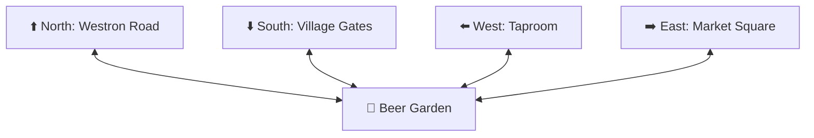
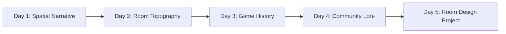

  

# 📚 Humanities & Literature Curriculum Track

  
    🏷️ Common Core ELA: CCSS.ELA-LITERACY.RL.11-12.7
  
  
    🏷️ AP Literature: Literary Adaptation & Spatial Prose
  
  
    🏷️ Digital Humanities: Digital Media Archaeology & Lore
  

Welcome to the **MUME Humanities & Literature Curriculum Track**. Text-based MUDs offer a unique interdisciplinary bridge between classic literature, spatial narrative theory, game design, and digital archaeology.

As a multi-decade adaptation of J.R.R. Tolkien's legendarium, **Multi-Users in Middle-earth (MUME)** provides high school and university literature classes with an active-learning laboratory to explore narrative worldbuilding, textual topography, and digital preservation.

---

## 📅 Curriculum Options: 45-Min Labs vs. 1-Week Unit Block

Educators can deliver these modules as standalone 45-minute lab sessions or combine them into a 5-day unit block:

### Option A: Express 45-Minute Single Period Labs
* **Lab 1 (45 min):** [Spatial Narrative & Worldbuilding](./lab-1-worldbuilding)
* **Lab 2 (45 min):** [MUD History & Digital Archaeology](./lab-2-game-history)
* **Lab 3 (45 min):** [Adaptation Studies: Prose vs. Interactive Grids](./lab-3-adaptation)
* **Lab 4 (45 min):** [Collaborative Storytelling & Player Lore](./lab-4-storytelling)

### Option B: 1-Week Integrated Unit Blueprint

| Day | Topic & Activity | Student Output |
| :--- | :--- | :--- |
| **Day 1** | **Spatial Narrative in Arda:** Analyze how literary geography in *The Lord of the Rings* translates into a 3D compass grid. | Comparative map analysis worksheet. |
| **Day 2** | **MUD History & Digital Archaeology:** Investigate MUME (operating continuously since 1992) as a living media artifact. | Primary source analysis essay. |
| **Day 3** | **Adaptation Studies (Prose vs Grid):** Compare Tolkien's passive prose descriptions (e.g. Rivendell) with MUME's interactive room grids. | Side-by-side adaptation matrix. |
| **Day 4** | **Collaborative Storytelling:** Analyze transcripts comparing scripted NPC interactions with unscripted player roleplay. | Narrative transcript analysis report. |
| **Day 5** | **Peer Blind-Mapping & Capstone Narrative:** Draft a canonical Middle-earth room description and peer-test floorplan accuracy. | Peer blind-map & room description. |

---

## 🎯 Course Alignment

This track aligns with curriculum standards for:
* **High School English Literature & Creative Writing**
* **Undergraduate Tolkien Studies & Literary Adaptation**
* **Game Design & Interactive Storytelling**
* **Digital Humanities & Media History**

---

## 📑 Literature Track Lab Index

  <h3>Lab 1: Spatial Narrative & Worldbuilding</h3>
  
Examine how Tolkien's rich textual descriptions are translated into spatial room grids, environmental narratives, and interactive geographical zones.

  <a href="./lab-1-worldbuilding" class="vp-button brand" style="display: inline-block; margin-top: 0.5rem;">Launch Lab 1 →</a>

  <h3>Lab 2: MUD History & Digital Archaeology</h3>
  
Analyze MUME (operating continuously since 1992) as a living digital artifact, exploring the evolution of virtual communities and MMORPG architecture.

  <a href="./lab-2-game-history" class="vp-button brand" style="display: inline-block; margin-top: 0.5rem;">Launch Lab 2 →</a>

  <h3>Lab 3: Adaptation Studies</h3>
  
Compare J.R.R. Tolkien's linear prose descriptions with MUME's interactive room grids using a formal adaptation matrix.

  <a href="./lab-3-adaptation" class="vp-button brand" style="display: inline-block; margin-top: 0.5rem;">Launch Lab 3 →</a>

  <h3>Lab 4: Collaborative Storytelling</h3>
  
Examine the dynamic tension between authored NPC dialogue scripts and unscripted, real-time player roleplay and community lore.

  <a href="./lab-4-storytelling" class="vp-button brand" style="display: inline-block; margin-top: 0.5rem;">Launch Lab 4 →</a>

