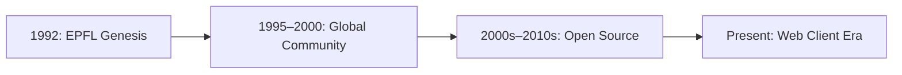

  

# 📚 Humanities Lab 2: MUD History & Digital Preservation

<Badge type="warning" text="🏷️ Digital Humanities: Primary Source Analysis & Media History" /> <Badge type="info" text="🏷️ Common Core ELA: CCSS.ELA-LITERACY.RH.11-12.1" />

| Attribute | Details |
| :--- | :--- |
| **Target Audience** | High School History, Media Studies, Digital Humanities, Game Design |
| **Duration** | 45-Minute Single Period (or Days 3-4 of 1-Week Unit) |
| **Prerequisites** | None |
| **Primary References** | MUME Historical Chronicles ([/about/history](../../../about/history)), Tolkien Gateway MUME Article ([TolkienGateway.net](https://tolkiengateway.net/wiki/MUME:_Multi_Users_in_Middle_Earth)), Web News Archive ([/news/web](../../../news/web)) |

---

## 🎯 1. Lab Overview & Objectives

Multi-User Dungeons (MUDs) were the pioneering digital precursors to modern social networks and Massively Multiplayer Online Role-Playing Games (MMORPGs) like *World of Warcraft*. **MUME (Multi-Users in Middle-earth)** was created in 1992 at EPFL (École Polytechnique Fédérale de Lausanne, Switzerland) and has operated continuously for over three decades. MUME is widely recognized in Tolkien scholarship and recorded in major literary encyclopedias like [Tolkien Gateway](https://tolkiengateway.net/wiki/MUME:_Multi_Users_in_Middle_Earth) as one of the most lore-faithful virtual representations of Middle-earth ever created.

In this lab, students act as **digital archaeologists**—examining MUME's history, primary historical artifacts, player culture, and the challenges of preserving early online text-based communities.

### Learning Outcomes
By the end of this lab, students will be able to:
1. Trace the architectural evolution from early text MUDs to modern graphical virtual worlds.
2. Analyze primary historical artifacts (survey results, player logs, web news archives) spanning 1992 to the present.
3. Evaluate the cultural importance of preserving open-source online communities.

---

## 💡 2. Historical Timeline: Over 3 Decades of MUME

* **1992:** Created by KTA (Pier Donini) and a small team of student developers in Switzerland as a DikuMUD derivative set in Middle-earth.
* **1995–2000:** Rapid growth into a global player community, documented by historical survey results ([/resources/questionnaires/](../../../resources/questionnaires/)).
* **2000s–2010s:** Development of open-source mapping software ([MMapper](../../../opensource)) and client automation.
* **2020s–Present:** Transition to zero-install HTML5/WebSocket web clients bringing MUME to modern web browsers.

---

## 🧪 3. Guided Primary Source Exploration (15 Minutes)

::: info 🏰 Classroom Sandbox Note
Students can explore primary historical questionnaires and survey archives online without needing live MUME client connections, making this lab ideal for offline classroom discussion days.
:::

### Task 1: Historical Artifact Analysis
1. Visit the [MUME History Chronicles](../../../about/history) and review foundational historical accounts, such as [MUME IV as described in Estonia](../../../about/m8).
2. Read MUME's entry on [Tolkien Gateway](https://tolkiengateway.net/wiki/MUME:_Multi_Users_in_Middle_Earth) to examine how independent Tolkien scholars document text-based digital adaptations.
3. Explore one of the historical player questionnaires (e.g., [October 1995 Survey Results](../../../resources/questionnaires/1995-09)).
4. Examine player demographic metrics:
   * Where were players connecting from in 1995?
   * What connection speeds (dial-up modems vs campus T1 lines) did they use?
   * What features did players value most?

---

## 🚀 4. Independent Student Challenge ("The Quest")

**Challenge Requirement: Digital Preservation Essay / Report**
Write a 250-word response analyzing MUME as a living digital artifact.

Address the following key points:
1. How has MUME managed to maintain an active player base continuously for over 30 years without major corporate backing or commercial funding?
2. What unique social or narrative advantages does pure text offer over 3D graphical graphics in building long-term player communities?

---

## 📝 5. Verification & Submission Requirements

Submit your completed essay and primary source worksheet:

1. **Primary Source Citation:** Cite one specific statistic or quote from the MUME historical survey archives ([/resources/questionnaires/](../../../resources/questionnaires/)).
2. **Comparative Analysis:** Compare how player interaction in a text MUD differs from modern social media platforms.
3. **Submitted Essay:** (250+ words).

---

::: details 🔑 Teacher Answer Key & Assessment Rubric (Click to Expand)

### 10-Point Grading Rubric

| Criterion | Points | Description |
| :--- | :---: | :--- |
| **Primary Source Citation** | 3 pts | Accurate citation and analysis of historical MUME survey/news data. |
| **Digital Archaeology Analysis** | 4 pts | Well-reasoned essay addressing MUD preservation and community longevity. |
| **Comparative Reflection** | 3 pts | Insightful comparison between text-based MUD environments and modern gaming/social platforms. |

:::
