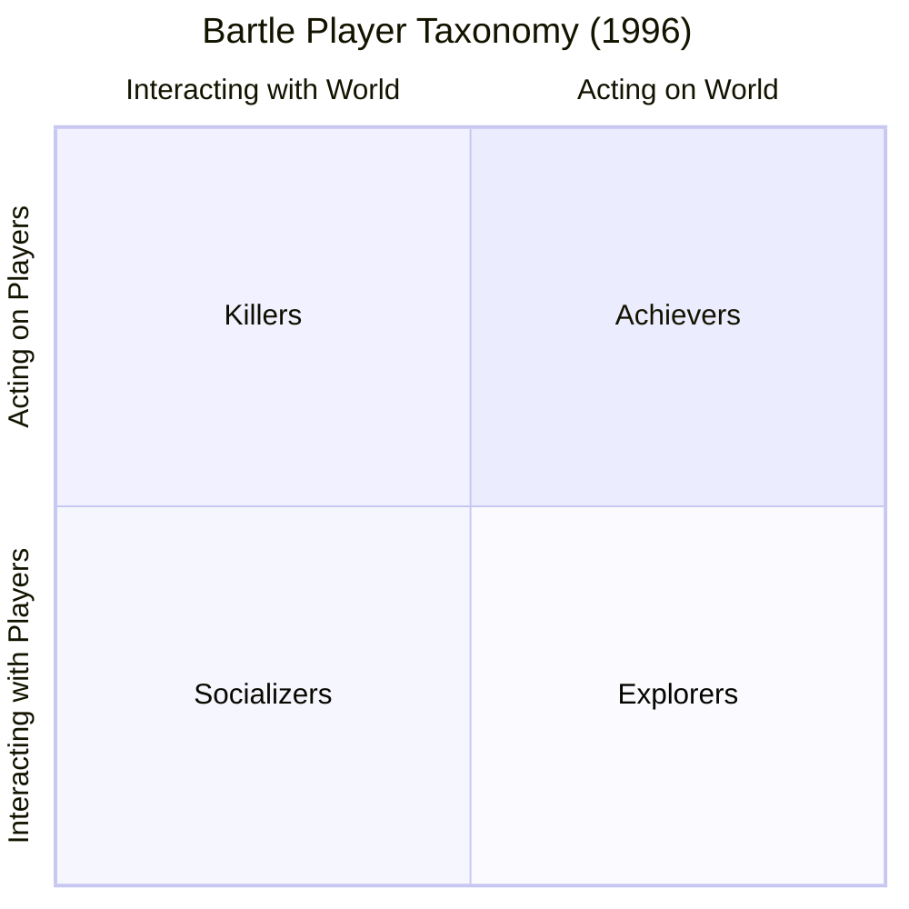

  

# 🎲 Game Design & RPG Dynamics Curriculum Track

  
    🏷️ College Game Design: Ludology & System Dynamics
  
  
    🏷️ Game Studies: Zero-Sum Scarcity & Asymmetric Factions
  
  
    🏷️ Player Psychology: Bartle Taxonomy (1996)
  

Welcome to the **MUME Game Design & RPG Dynamics Curriculum Track**. This track serves higher education and high school courses in **Game Design**, **Interactive Media**, **Ludology**, and **Game Studies**.

Rather than relying on inflated commercial virtual economies, **Multi-Users in Middle-earth (MUME)** is built around **finite zero-sum resource scarcity** and **asymmetric player conflict**. Students examine how non-renewable item caps, permanent equipment degradation, light/dark vision mechanics, and opposing faction alignment (Free Peoples vs. Sauron's forces) drive organic player conflict and strategic risk management.

---

## 📅 Curriculum Options: 45-Min Labs vs. 1-Week Unit Block

Educators can deliver these modules as standalone 45-minute lab sessions or combine them into a 5-day game design unit:

### Option A: Express 45-Minute Single Period Labs
* **Lab 1 (45 min):** [From Tabletop to Digital - Adding Dimensions](./lab-1-ttrpg-evolution)
* **Lab 2 (45 min):** [RPG Dynamics & Bartle Player Taxonomy Critique](./lab-2-system-critique)
* **Lab 3 (45 min):** [Zero-Sum Scarcity & Item Competition](./lab-3-scarcity)
* **Lab 4 (45 min):** [Faction Friction & Asymmetric World Design](./lab-4-asymmetric-factions)

### Option B: 1-Week Integrated Game Design Blueprint

| Day | Topic & Activity | Student Output |
| :--- | :--- | :--- |
| **Day 1** | **Tabletop Roots (D&D Mechanics):** Trace how hit points, armor class, stats, and dice rolls were translated from paper to software. | TTRPG vs. MUD mechanics comparison table. |
| **Day 2** | **Bartle Player Taxonomy:** Apply Richard Bartle's 1996 player types (Achievers, Explorers, Socializers, Killers) to analyze player motivations. | Bartle player profile evaluation. |
| **Day 3** | **Zero-Sum Scarcity & Competition:** Analyze how global item caps, equipment loss, and finite trophy pools force organic risk-vs-reward decisions. | Resource scarcity audit worksheet. |
| **Day 4** | **Asymmetric Factions & Environmental Friction:** Evaluate how light/dark vision, opposing alignments, and geography drive open-world PvP conflict. | Asymmetric balance critique report. |
| **Day 5** | **Capstone System Redesign Proposal:** Propose concrete mechanics modifications to balance scarcity or faction friction for a target player archetype. | Submitted redesign proposal & presentation. |

---

## 🎯 Course Alignment

This track is designed for:
* **Undergraduate & Graduate Game Design / Game Studies**
* **Interactive Narrative & Media Architecture**
* **Computer Science in Games & Simulation**
* **Game Psychology & User Experience (UX/UI)**

---

## 📑 RPG Dynamics Track Lab Index

  <h3>Lab 1: From Tabletop to Digital - Adding Dimensions</h3>
  
Examine how software mechanics automate real-time simultaneous combat, enforce spatial fog-of-war, and execute complex state math in ways pen-and-paper cannot.

  <a href="./lab-1-ttrpg-evolution" class="vp-button brand" style="display: inline-block; margin-top: 0.5rem;">Launch Lab 1 →</a>

  <h3>Lab 2: RPG Dynamics & Bartle Taxonomy Critique</h3>
  
Apply Richard Bartle's foundational 1996 player taxonomy (Achievers, Explorers, Socializers, Killers) to critique MUD/VTT systems and propose targeted UX redesigns.

  <a href="./lab-2-system-critique" class="vp-button brand" style="display: inline-block; margin-top: 0.5rem;">Launch Lab 2 →</a>

  <h3>Lab 3: Zero-Sum Scarcity & Competition</h3>
  
Analyze how strict global item caps, non-renewable gear states, and finite trophy pools drive organic player competition and high-stakes risk management.

  <a href="./lab-3-scarcity" class="vp-button brand" style="display: inline-block; margin-top: 0.5rem;">Launch Lab 3 →</a>

  <h3>Lab 4: Faction Friction & Asymmetric Design</h3>
  
Examine how mechanical asymmetry (Free Peoples vs. Sauron's forces, dark vision vs. light, safe haven sanctuaries) generates persistent world tension and team dynamics.

  <a href="./lab-4-asymmetric-factions" class="vp-button brand" style="display: inline-block; margin-top: 0.5rem;">Launch Lab 4 →</a>

