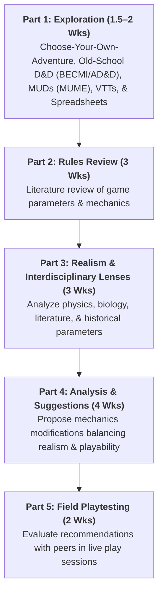
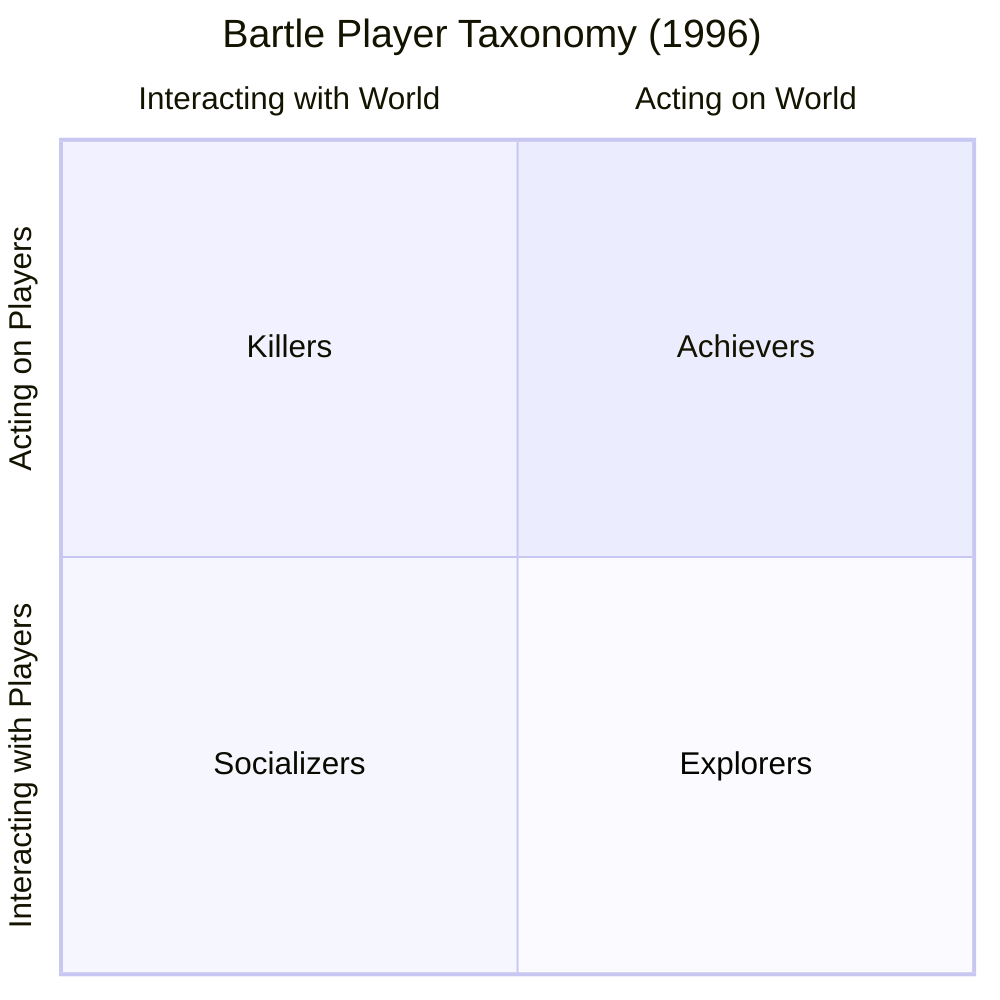

  

# 🎲 Game Design & RPG Dynamics Curriculum Track

  
    🏷️ Interdisciplinary Writing-Enhanced Course (e.g., JINS350)
  
  
    🏷️ Game Studies: Realism vs. Playability Balance
  
  
    🏷️ Player Psychology: Bartle Taxonomy & System Dynamics
  

Welcome to the **MUME Game Design & RPG Dynamics Curriculum Track**. This track serves higher education and high school courses in **Game Design**, **Interactive Media**, **Ludology**, and **Interdisciplinary Writing-Enhanced Studies (e.g., JINS350 Realism v. Playability)**.

Rather than relying on inflated commercial virtual economies, **Multi-Users in Middle-earth (MUME)** is built around **finite zero-sum resource scarcity**, **interdisciplinary realism (biology, physics, literature, history)**, and **asymmetric player conflict**. Students examine how non-renewable item caps, armor absorption, encumbrance physics, light/dark vision mechanics, and opposing faction alignments drive organic player conflict while balancing **playability (ease of play)** against **realism (suspension of disbelief)**.

---

## 🏛️ Interdisciplinary Term Project Framework: Realism vs. Playability

This track directly supports writing-enhanced interdisciplinary term papers where students analyze an aspect of game dynamics through non-gaming academic lenses (biology, physics, literature, mythology, military history):

### Core Interdisciplinary Research Questions:
* **Armor Mechanics:** Is armor best modeled as Evasion (D&D Armor Class) or Damage Absorption (MUME percentage damage reduction by armor type)? How does material science and medieval military history inform playability?
* **Ecological & Biological Realism:** How do nocturnal physiology, stamina drain, and encumbrance limits enhance suspension of disbelief without creating tedious cognitive overhead?
* **Information Technology in RPGs:** How do text-based MUDs (MUME) and Virtual Tabletops (VTTs like FoundryVTT) utilize spreadsheets and database state math to automate complex real-world variables?

---

## 📅 Curriculum Options: 45-Min Labs vs. Full Term Project

Educators can deliver these modules as standalone 45-minute lab sessions or scaffold them into a semester-long writing project:

### 45-Minute Express Labs
* **Lab 1 (45 min):** [From Tabletop to Digital - Adding Dimensions & Armor Mechanics](./lab-1-ttrpg-evolution)
* **Lab 2 (45 min):** [RPG Dynamics & Bartle Player Taxonomy Critique](./lab-2-system-critique)
* **Lab 3 (45 min):** [Zero-Sum Scarcity & Encumbrance Physics](./lab-3-scarcity)
* **Lab 4 (45 min):** [Faction Friction, Nocturnal Biology & Asymmetric Design](./lab-4-asymmetric-factions)

---

## 📑 RPG Dynamics Track Lab Index

  <h3>Lab 1: From Tabletop to Digital - Armor & IT Evolution</h3>
  
Trace the transition from fighting fantasy books and old-school D&D (BECMI/AD&D) to real-time text MUDs and VTTs. Compare Armor Class evasion vs. armor damage absorption math.

  <a href="./lab-1-ttrpg-evolution" class="vp-button brand" style="display: inline-block; margin-top: 0.5rem;">Launch Lab 1 →</a>

  <h3>Lab 2: RPG Dynamics & Bartle Taxonomy Critique</h3>
  
Apply Richard Bartle's 1996 player taxonomy to evaluate how real-time mechanical complexity impacts player retention and cognitive playability for different archetypes.

  <a href="./lab-2-system-critique" class="vp-button brand" style="display: inline-block; margin-top: 0.5rem;">Launch Lab 2 →</a>

  <h3>Lab 3: Zero-Sum Scarcity & Encumbrance Physics</h3>
  
Analyze how strict global item caps, equipment weight, and physical stamina mechanics create meaningful risk management while balancing realism and playability.

  <a href="./lab-3-scarcity" class="vp-button brand" style="display: inline-block; margin-top: 0.5rem;">Launch Lab 3 →</a>

  <h3>Lab 4: Faction Friction, Nocturnal Physiology & Asymmetry</h3>
  
Examine how biological parameters (sunlight weakness for Orcs/Trolls, night vision for Dark Forces) and geographic safe havens create persistent world tension.

  <a href="./lab-4-asymmetric-factions" class="vp-button brand" style="display: inline-block; margin-top: 0.5rem;">Launch Lab 4 →</a>

