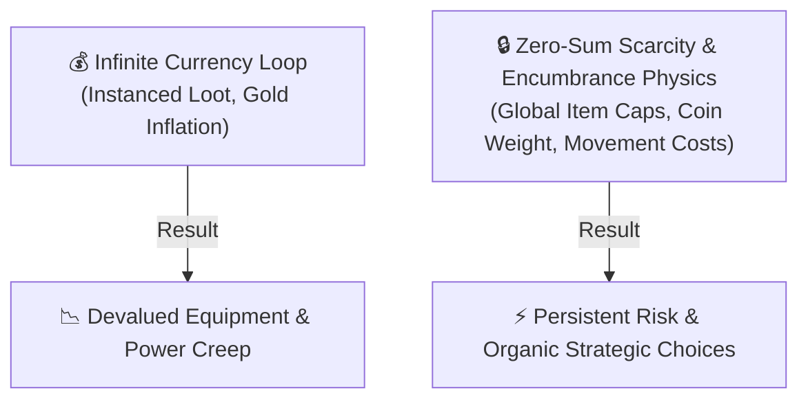

  

# 🎲 RPG Dynamics Lab 3: Zero-Sum Scarcity & Encumbrance Physics

  
    🏷️ Interdisciplinary RPG Design (e.g., JINS350 Framework)
  
  
    🏷️ Game Studies: Zero-Sum Economics & Encumbrance Physics
  

| Attribute | Details |
| :--- | :--- |
| **Target Audience** | Game Design, Game Economics, Physics/Biology in Gaming, Systems Design |
| **Duration** | 45-Minute Single Period (or Week 3 Realism Unit) |
| **Prerequisites** | RPG Dynamics Lab 1 & Lab 2 |
| **Primary Reference** | MUME Equipment & Encumbrance Rules, Physics of Carrying Capacity |

---

## 🎯 1. Lab Overview & Objectives

In many commercial games, inventory management is simplified into abstract "slot counts" or ignored entirely, allowing characters to carry dozens of suits of armor without physical penalty.

In **MUME**, item systems are governed by **Zero-Sum Scarcity** and **Encumbrance Physics**:
1. **Global Item Caps (`max_exist`):** Legendary items exist in strictly capped global quantities across Middle-earth.
2. **Physical Weight & Coin Weight:** Equipment, weapons, and silver/gold coins carry actual physical weight in pounds.
3. **Stamina & Terrain Movement Costs:** Carrying heavy gear rapidly drains movement points (stamina), particularly when traversing steep mountain passes or muddy swamps.

In this lab, students evaluate the **Realism vs. Playability** trade-off: how physical encumbrance and item caps heighten realism and strategic depth without overwhelming player usability.

---

## 💡 2. Core Theory Walkthrough: Encumbrance Physics & Scarcity

### Realism vs. Playability Parameters:

1. **Weight Distribution & Coin Weight:** In real-world physics and medieval logistics, wealth is heavy. Carrying 5,000 copper coins weighs down a scout as much as iron plate armor. MUME enforces this physical reality, requiring players to store excess gold in city banks or risk exhaustion.
2. **Stamina & Terrain Vectors:** Moving through uphill forest terrain while carrying 80 lbs of gear consumes movement points at 3x the rate of walking unencumbered along the Great East Road.
3. **Global Item Caps (`max_exist`):** High-tier artifacts have hard server caps (e.g., only 5 exist globally). If all 5 are held by players, mobs drop no more until one is destroyed or lost upon death.

---

## 🧪 3. Guided Encumbrance Test in MUME (20 Minutes)

::: info 🏰 Classroom Sandbox Note
Students can test encumbrance physics in **Bree** or **Black Hill Village** by picking up heavy items (containers, barrels, or armor) and comparing stamina movement drain across different terrains.
:::

1. Connect to the <a href="https://mume.org/play" target="_self" rel="external">MUME Web Client</a>.
2. Type `score` and `inventory` to view your current character weight and movement points.
3. Walk along a paved road (`east`, `west`) and note movement point consumption per room.
4. Pick up heavy gear or coin sacks (`get all chest`) and walk through wilderness terrain (hills or forest). Note the accelerated movement point depletion rate.

<MumeSession>
<pre class="session" v-pre>
> score
You are carrying 62 lbs (Carrying capacity: 110 lbs).
Movement: 42/110 (Tired).
Terrain: Steep Mountain Slope [Up, Down]

> up
You struggle up the steep rocky incline, panting under the weight of your pack.
Movement: 24/110 (Exhausted!)
</pre>
</MumeSession>

---

## 🚀 4. Independent Student Challenge ("The Quest")

**Design Analysis Assignment: Realism vs. Playability Report**
Write a 250-word interdisciplinary analysis on Encumbrance Physics in RPGs.

Address the following points:
1. **Realism (Suspension of Disbelief):** How does enforcing weight and terrain movement costs improve immersion and tactical planning compared to games where weight is ignored?
2. **Playability (Ease of Play):** At what point does strict encumbrance physics become tedious for players? How does MUME's automated server calculation prevent math friction while keeping weight mechanically meaningful?

---

## 📝 5. Verification & Submission Requirements

Submit your completed analysis along with:
1. **Terminal Log:** Excerpt from your MUME session showing weight stats and movement point drain.
2. **Realism vs. Playability Essay:** (250+ words).

---

::: details 🔑 Teacher Assessment Rubric (Click to Expand)

### 10-Point Grading Rubric

| Criterion | Points | Description |
| :--- | :---: | :--- |
| **Encumbrance Test Verification** | 3 pts | Terminal log proving active in-game testing of weight and terrain movement drain. |
| **Realism Analysis** | 4 pts | Well-reasoned evaluation of physics/encumbrance parameters on player immersion. |
| **Playability Recommendations** | 3 pts | Insightful discussion on balancing physical fidelity with user interface convenience. |

:::
