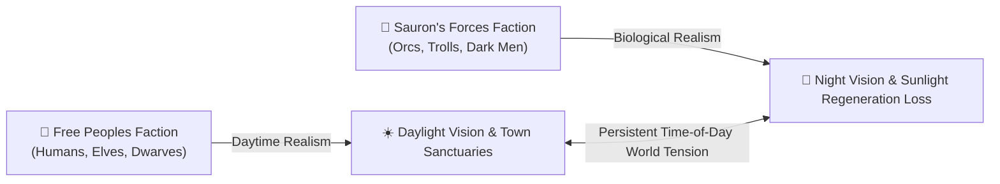

  

# 🎲 RPG Dynamics Lab 4: Faction Friction, Nocturnal Biology & Asymmetry

  
    🏷️ Interdisciplinary RPG Design (e.g., JINS350 Framework)
  
  
    🏷️ Biological & Mythological Realism: Nocturnal Physiology & Asymmetric Systems
  

| Attribute | Details |
| :--- | :--- |
| **Target Audience** | Game Design, Interdisciplinary Ludology, Biology/Literature in Gaming, Systems Design |
| **Duration** | 45-Minute Single Period (or Week 4 Analysis Unit) |
| **Prerequisites** | RPG Dynamics Lab 1, Lab 2, & Lab 3 |
| **Primary Reference** | MUME Faction Alignment, Nocturnal Physiology & Vision Rules, Tolkien Mythology |

---

## 🎯 1. Lab Overview & Objectives

In many symmetric competitive games, opposing factions share identical biological traits, movement speeds, and visual feedback (like mirrored chess pieces or FPS teams).

By contrast, **MUME** grounds faction conflict in **Biological Realism** and **Canonical Lore**:
* **Free Peoples (Humans, Elves, Dwarves, Hobbits):** Thrives in daylight; requires torch light sources in dark caves; protected by civilized town guards.
* **Sauron's Forces (Orcs, Trolls, Black Númenóreans):** Possess natural night vision (tapetum lucidum biological adaptations); suffer physical stat degradation or petrification in direct sunlight; sheltered in dark underground fortresses.

In this lab, students evaluate the **Realism vs. Playability** trade-off: how incorporating biological parameters and interdisciplinary literature/mythology enriches suspension of disbelief while maintaining balanced, playable PvP friction.

---

## 💡 2. Core Theory Walkthrough: Asymmetric Biological Parameters

### Realism vs. Playability Parameters:

1. **Nocturnal Adaptation vs. Sunlight Penalty:** In Tolkien's literature and comparative biology, subterranean species (Orcs, Trolls) suffer photophobia and severe physical fatigue when exposed to UV radiation. MUME encodes this biological reality: Orcs lose stamina and strength under noon sun, forcing them to conduct ambushes at night or travel through shaded forest paths.
2. **Sensory Information Asymmetry:** Elves require light sources in pitch-dark dungeons, while Dark Forces see clearly in the dark but are blinded by bright magical flashes.
3. **Geographical Sanctuaries & Chokepoints:** Civilized town guards (Bree, Rivendell) attack Dark Forces on sight, while Orcish keeps (Moria, Goblin Gate) harbor evil players, creating safe havens connected by contested wilderness corridors (The East Road).

---

## 🧪 3. Guided Race & Vision Audit (20 Minutes)

::: info 🏰 Classroom Sandbox Note
Students can inspect biological and vision traits in MUME help files (`help orc`, `help troll`, `help elf`, `help daylight`) or test light source commands in town.
:::

1. Connect to the <a href="https://mume.org/play" target="_self" rel="external">MUME Web Client</a>.
2. Complete the asymmetric biology & vision comparison table:

| Biological / Game Parameter | Free Peoples (Elves / Humans) | Sauron's Forces (Orcs / Trolls) | Interdisciplinary Lens (Biology / Literature) |
| :--- | :--- | :--- | :--- |
| **Daytime Vision & Stats** | Full clear vision; normal stat regeneration. | Reduced vision; physical fatigue / petrification under sun. | **Comparative Biology:** Photophobia & UV sensitivity in subterranean fauna. |
| **Nighttime Vision & Stats** | Requires torch light source; vulnerable in dark. | Total dark vision; maximum combat stats. | **Ophthalmology:** Tapetum lucidum night-vision adaptation. |
| **Sanctuaries & Geography** | Bree, Rivendell, Fornost. | Moria, Carn Dûm, Goblin Gate. | **Military History:** Fortified borderlands & chokepoints. |

---

## 🚀 4. Independent Student Challenge ("The Quest")

**Design Analysis Assignment: Asymmetric Realism & Playability Report**
Write a 250-word interdisciplinary report analyzing Asymmetric Biological Realism in MUME.

Address the following points:
1. **Realism (Suspension of Disbelief):** How does linking game mechanics to biological lore (sunlight penalties for Orcs) create a richer, more authentic world than symmetric faction designs?
2. **Playability (System Balance):** How can game designers prevent biological handicaps (like sunlight weakness) from becoming so severe that players refuse to play as Dark Forces?

---

## 📝 5. Verification & Submission Requirements

Submit your completed analysis along with:
1. **Asymmetric Biological Table:** Completed 3-row comparison table.
2. **Realism vs. Playability Essay:** (250+ words).

---

::: details 🔑 Teacher Assessment Rubric (Click to Expand)

### 10-Point Grading Rubric

| Criterion | Points | Description |
| :--- | :---: | :--- |
| **Biological Table Accuracy** | 4 pts | Complete, accurate identification of faction biological parameters and interdisciplinary lenses. |
| **Realism Analysis** | 3 pts | Insightful explanation of how nocturnal biology and lore enhance suspension of disbelief. |
| **Playability Recommendations** | 3 pts | Well-reasoned suggestions on balancing asymmetric biological handicaps in competitive multiplayer games. |

:::
