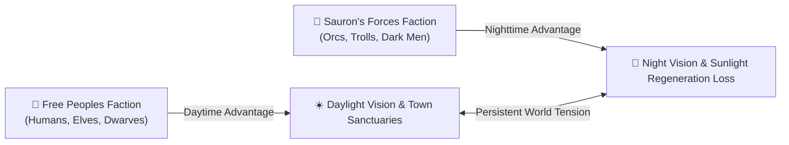

  

# 🎲 RPG Dynamics Lab 4: Faction Friction & Asymmetric World Design

  
    🏷️ College Game Design: Asymmetric Systems & World Balance
  
  
    🏷️ Game Studies: Faction Dynamics & Open-World PvP
  

| Attribute | Details |
| :--- | :--- |
| **Target Audience** | Game Design, Level Design, Systems Architecture, Game Studies |
| **Duration** | 45-Minute Single Period (or Day 4 of 1-Week Unit) |
| **Prerequisites** | RPG Dynamics Lab 1, Lab 2, & Lab 3 |
| **Primary Reference** | MUME Faction Alignment & Vision Rules |

---

## 🎯 1. Lab Overview & Objectives

In multiplayer game design, **symmetric balance** gives all players identical abilities, starting locations, and visual feedback (like chess or mirrored FPS maps). **Asymmetric design**, by contrast, intentionally gives opposing factions contrasting strengths, weaknesses, spatial safe havens, and sensory mechanics.

In MUME, the perpetual conflict between the **Free Peoples** (Humans, Elves, Dwarves, Hobbits) and **Sauron's Forces** (Orcs, Trolls, Black Númenóreans) is governed by profound mechanical asymmetry. In this lab, students analyze how asymmetric vision, alignment geography, and safe sanctuaries generate persistent world tension.

### Learning Outcomes
1. Define **asymmetric balance** in competitive multiplayer game design.
2. Analyze MUME's environmental vision mechanics (Dark Vision vs. Light Sensitivity).
3. Evaluate how spatial geography (Safe Haven Sanctuaries vs. Wilderness Chokepoints) structures territorial conflict.

---

## 💡 2. Core Theory Walkthrough: Mechanical Asymmetry in MUME

### The 3 Asymmetric Design Vectors:

1. **Sensory Asymmetry (Vision & Light):**
   * **Free Peoples:** See clearly during daytime and in lit areas; blind in pitch dark without torches.
   * **Sauron's Forces (Orcs/Trolls):** Possess natural night-vision; suffer vision penalties or physical stat loss (Trolls turn to stone or weaken) in direct sunlight.
2. **Geographical Sanctuaries & Chokepoints:**
   * **Free Peoples Sanctuaries:** Safe towns like Rivendell, Bree, and Fornost guarded by high-level NPC guards.
   * **Sauron's Sanctuaries:** Dark keeps like Moria, Carn Dûm, and Goblin Gate.
   * **Wilderness Chokepoints:** Unprotected travel corridors (The East Road, The Last Bridge) where opposing factions inevitably collide.
3. **Communication Barriers:**
   * Free Peoples speak Westron; Orcs speak Black Speech. Players cannot read opposing faction chat channels without learning ancient languages, reinforcing cultural division.

---

## 🧪 3. Guided Analysis Activity (20 Minutes)

::: info 🏰 Classroom Sandbox Note
Students review MUME race help files (`help orc`, `help elf`, `help troll`) or examine geography maps to audit asymmetric race traits and vision mechanics.
:::

### Step 1: Asymmetric Trait Audit
Fill out the asymmetric race matrix comparing Elves and Orcs/Trolls:

| Design Dimension | Free Peoples (Elves / Humans) | Sauron's Forces (Orcs / Trolls) |
| :--- | :--- | :--- |
| **Daytime Performance** | Optimal vision and movement speed. | Stat penalties / Sunlight weakness. |
| **Nighttime Performance** | Requires torch light source; vulnerable to ambush. | Total dark vision; maximum combat stats. |
| **Safe Havens** | Bree, Rivendell, Blue Mountains. | Moria, Carn Dûm, Mount Gram. |
| **Strategic Advantage** | Superior archery, stealth, and magical healing. | Brute strength, dark vision, and numbers. |

---

## 🚀 4. Independent Student Challenge ("The Quest")

**Design Critique Assignment: Asymmetric Balance Audit**

Select ONE asymmetric mechanic from MUME (e.g., *Day/Night Vision*, *Sunlight Damage*, *Safe Haven Guards*, or *Language Barriers*).

Write a 250-word Game Design Critique addressing:
1. How does this asymmetric mechanic force opposing players to adapt their tactical playstyles based on time-of-day or spatial location?
2. How can game designers prevent asymmetric mechanics from feeling "unfair" to one faction?

---

## 📝 5. Verification & Submission Requirements

Submit your completed analysis:
1. **Asymmetric Race Matrix:** Completed 4-row trait matrix.
2. **Asymmetric Design Critique Essay:** (250+ words).

---

::: details 🔑 Teacher Assessment Rubric (Click to Expand)

### 10-Point Grading Rubric

| Criterion | Points | Description |
| :--- | :---: | :--- |
| **Asymmetric Matrix Accuracy** | 4 pts | Complete, accurate identification of faction strengths, weaknesses, and vision traits. |
| **Asymmetric Balance Critique** | 3 pts | Thoughtful analysis of how day/night cycles and spatial geography balance opposing factions. |
| **Game Design Insights** | 3 pts | Well-reasoned suggestions on preventing player frustration in asymmetric PvP systems. |

:::
