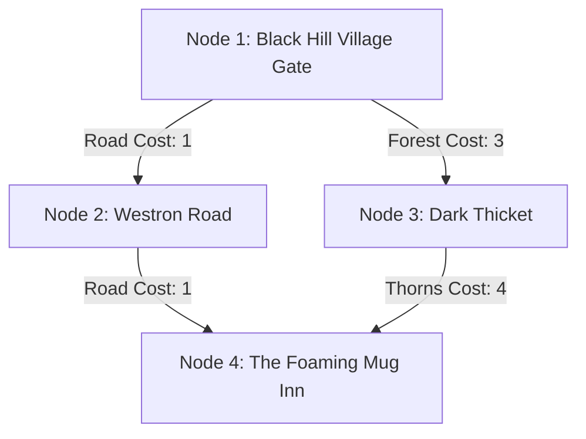

<div class="page-banner">
  
</div>

# 💻 CS Lab 4: Client Automation & Graph Pathfinding

<div style="display: flex; flex-wrap: wrap; gap: 0.6rem; margin: 1rem 0;">
  <span style="border: 1px solid rgba(215, 166, 63, 0.4); background: rgba(215, 166, 63, 0.1); padding: 0.3rem 0.6rem; border-radius: 4px; font-weight: 600; font-size: 0.82rem; color: var(--vp-c-brand-1);">
    🏷️ AP CSP: AAP-3 (Algorithms), DAT-2 (Graph Structures)
  </span>
  <span style="border: 1px solid rgba(59, 130, 246, 0.4); background: rgba(59, 130, 246, 0.1); padding: 0.3rem 0.6rem; border-radius: 4px; font-weight: 600; font-size: 0.82rem; color: #60a5fa;">
    🏷️ CSTA: 3B-AP-16, 3B-AP-20
  </span>
  <span style="border: 1px solid rgba(16, 185, 129, 0.4); background: rgba(16, 185, 129, 0.1); padding: 0.3rem 0.6rem; border-radius: 4px; font-weight: 600; font-size: 0.82rem; color: #34d399;">
    🏷️ College CS: CS201 / Data Structures & Algorithms
  </span>
</div>

| Attribute | Details |
| :--- | :--- |
| **Target Audience** | AP CS Principles, CS201 (Data Structures & Algorithms), Game AI |
| **Duration** | 45-Minute Single Period (or Day 4 of 1-Week Unit) |
| **Prerequisites** | CS Lab 1, Lab 2, & Lab 3 |
| **Reference Client** | <a href="https://docs.mume.org/MMapper/" target="_self" rel="external">MMapper Open Source Automapper</a> |

---

## 🎯 1. Lab Overview & Objectives

In navigation software—from Google Maps to video game pathfinding—spatial geography is modeled as a **Graph** data structure consisting of **Vertices (Nodes)** and **Edges (Connections)**.

In text-based MUDs like MUME, automapper tools (such as [MMapper](../../../opensource)) build directed graph representations where **rooms are nodes** and **exit directions are directed, weighted edges**. In this lab, students analyze graph traversal algorithms including **Breadth-First Search (BFS)** and **Dijkstra's Algorithm** to calculate optimal travel paths.

### Learning Outcomes
1. Represent a MUD spatial room grid as a directed, weighted graph $G = (V, E)$.
2. Trace Breadth-First Search (BFS) for unweighted shortest path calculation.
3. Compare unweighted BFS with weighted Dijkstra pathfinding when accounting for movement terrain costs (e.g., roads vs. dense forests).

---

## 💡 2. Core Theory Walkthrough: Graph Traversal in Spatial Worlds

Consider a 4-room quadrant in Middle-earth:



### Graph Components:
* **Vertices ($V$):** Distinct virtual rooms defined by unique room IDs or VNUMs.
* **Edges ($E$):** Compass directional links (`North`, `South`, `East`, `West`, `Up`, `Down`).
* **Edge Weights ($W$):** Character movement point cost required to traverse terrain (e.g., Paved Road = 1 MV, Dense Forest = 3 MV, Mountain Ascent = 6 MV).

### Unweighted BFS vs. Weighted Dijkstra Pathfinding:
* **Unweighted Shortest Path (BFS):** Counts the minimum number of room hops regardless of movement energy cost.
* **Weighted Shortest Path (Dijkstra):** Minimizes total movement point expenditure ($\sum W_i$), choosing longer room hops over low-cost terrain to conserve character vitality.

---

## 🧪 3. Guided Hands-On Task (20 Minutes)

::: info 🏰 Classroom Sandbox Note
Students can use MMapper Web or trace room connections manually in **Black Hill Village** or **Bree Road**, observing how movement points (`MV`) decrease based on terrain types.
:::

### Step 1: Construct an Adjacency List Matrix
Using the graph diagram above, fill out the directed adjacency representation:

```python
# Python Graph Representation
graph = {
    'Village Gate': [('Westron Road', 1), ('Dark Thicket', 3)],
    'Westron Road': [('Foaming Mug Inn', 1)],
    'Dark Thicket': [('Foaming Mug Inn', 4)],
    'Foaming Mug Inn': []
}
```

### Step 2: Trace BFS Shortest Path
1. Start at `Village Gate` targeting `Foaming Mug Inn`.
2. BFS Queue Traversal:
   * Level 1: `Westron Road` (1 hop), `Dark Thicket` (1 hop)
   * Level 2: `Foaming Mug Inn` via `Westron Road` (2 hops)
3. **BFS Result:** Path `Village Gate -> Westron Road -> Foaming Mug Inn` (2 room hops, Total MV Cost: 2).

---

## 🚀 4. Independent Challenge (Advanced Extension)

**Challenge Requirement:**
A player is at `Village Gate` with only **3 Movement Points (MV)** remaining.
* Route A (`Village Gate -> Dark Thicket -> Foaming Mug Inn`) requires 2 room hops but costs **7 MV**.
* Route B (`Village Gate -> Westron Road -> Foaming Mug Inn`) requires 2 room hops and costs **2 MV**.

Write a pseudocode algorithm for Dijkstra's Algorithm that selects Route B over Route A by prioritizing path cost (`MV`) over hop count:

```python
def dijkstra(graph, start, target):
    # Initialize distances with infinity
    distances = {node: float('inf') for node in graph}
    distances[start] = 0
    # Your pathfinding logic here...
```

---

## 📝 5. Verification & Submission Requirements

Submit your completed graph analysis worksheet:
1. **Adjacency Table:** Completed adjacency list showing nodes, exits, and terrain movement weights.
2. **Algorithm Comparison:** Explain a scenario in MUME where BFS yields a faster room hop count but causes the player to collapse from exhaustion due to ignored terrain weights.
3. **Pseudocode Solution:** Completed Dijkstra or BFS pathfinding code submission.

---

## 📥 Teacher Resource Download

<div style="border: 1px solid rgba(215, 166, 63, 0.35); border-radius: 8px; padding: 1.25rem; background: rgba(215, 166, 63, 0.05); margin: 1.5rem 0; display: flex; align-items: center; justify-content: space-between; flex-wrap: wrap; gap: 1rem;">
  <div>
    <h3 style="margin: 0; font-size: 1.1rem; color: var(--vp-c-brand-1);">📄 CS Lab 4 Teacher Resource Pack</h3>
    <p style="margin: 0.25rem 0 0 0; font-size: 0.88rem; color: var(--vp-c-text-2);">Includes printable graph worksheets, Python/Lua pathfinding starter templates, MMapper map files, and full answer keys.</p>
  </div>
  <a href="../student" class="vp-button brand" style="padding: 0.5rem 1.2rem; font-size: 0.9rem; text-decoration: none;">Download Teacher Pack 📥</a>
</div>

---

::: details 🔑 Teacher Answer Key & Assessment Rubric (Click to Expand)

### Dijkstra Solution (Python)
```python
import heapq

def dijkstra(graph, start, target):
    queue = [(0, start, [])]
    visited = set()

    while queue:
        (cost, node, path) = heapq.heappop(queue)
        if node not in visited:
            visited.add(node)
            path = path + [node]
            if node == target:
                return (cost, path)
            for (neighbor, weight) in graph.get(node, []):
                if neighbor not in visited:
                    heapq.heappush(queue, (cost + weight, neighbor, path))
    return (float('inf'), [])
```

### 10-Point Grading Rubric

| Criterion | Points | Description |
| :--- | :---: | :--- |
| **Graph Representation** | 3 pts | Accurate node and weighted edge matrix construction. |
| **BFS vs. Dijkstra Analysis** | 3 pts | Clear conceptual distinction between room hop count vs. terrain movement cost. |
| **Pathfinding Code** | 4 pts | Functional Dijkstra or BFS algorithm implementation. |

:::
