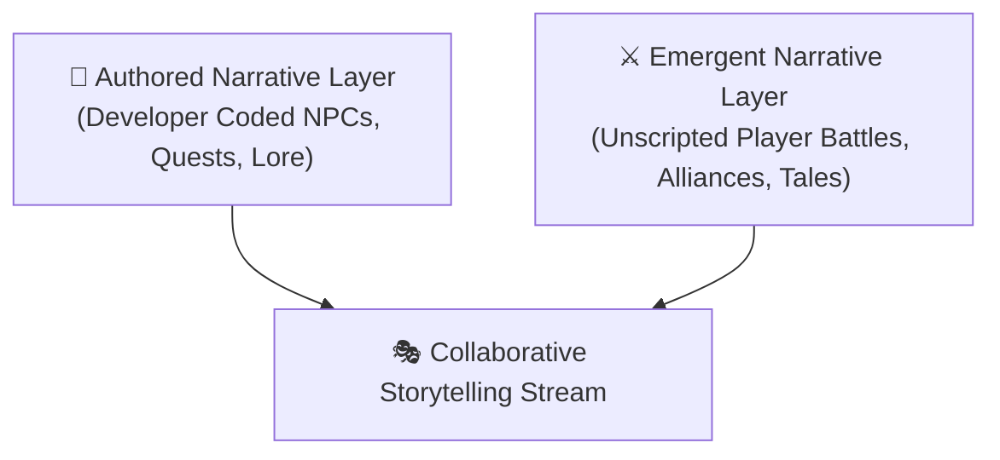

  

# 📚 Humanities Lab 4: Collaborative Storytelling & Player Lore

  
    🏷️ Common Core ELA: CCSS.ELA-LITERACY.SL.11-12.1 (Collaborative Discussion)
  
  
    🏷️ AP Literature: Unscripted Narrative & Community Lore
  
  
    🏷️ Digital Humanities: Emergent Narrative & Oral Tradition
  

| Attribute | Details |
| :--- | :--- |
| **Target Audience** | High School Creative Writing, AP Literature, Media Studies, Digital Humanities |
| **Duration** | 45-Minute Single Period (or Day 4 of 1-Week Unit) |
| **Prerequisites** | Humanities Lab 1 or Lab 2 |
| **Primary Archives** | MUME Web Boards ([/resources/boards/](../../../resources/boards/)) & Player Chronicles |

---

## 🎯 1. Lab Overview & Objectives

In traditional literature, storytelling is a **top-down, single-author monologue**. In multiplayer virtual worlds like MUME, narrative becomes a **dynamic, collaborative dialogue** blending hard-coded NPC dialogue scripts with emergent, unscripted player roleplay and player-written community chronicles.

In this lab, students analyze session transcripts and player board posts to compare authored NPC dialogue trees against unscripted, real-time player roleplay and community lore.

### Learning Outcomes
1. Differentiate between **authored/scripted narrative** (developer-coded) and **emergent narrative** (player-created).
2. Analyze session transcripts for in-character roleplay etiquette (`say`, `tell`, `emote`, `narrate`).
3. Evaluate how MUME's player boards function as a modern digital equivalent of medieval oral storytelling traditions.

---

## 💡 2. Core Theory Walkthrough: Authored vs. Emergent Narrative

Virtual worlds operate across two distinct narrative layers:

### Transcript Comparison:

#### Layer 1: Scripted NPC Interaction (Authored)
<MumeSession>
<pre class="session" v-pre>
> ask ermin hunt
Ermin the Ranger says 'Troll tracks have been spotted near the Black Hills.'
Ermin the Ranger says 'Take this torch and watch the eastern passes at nightfall.'
</pre>
</MumeSession>

#### Layer 2: Unscripted Player Roleplay (Emergent)
<MumeSession>
<pre class="session" v-pre>
An Elven Scout arrives from the east, riding a white horse.
> say Greetings, stranger of the Westron Road.
You say 'Greetings, stranger of the Westron Road.'
The Elven Scout bows deeply and says 'The shadow falls long over the Greenway. Will you stand with us at the Last Bridge?'
</pre>
</MumeSession>

---

## 🧪 3. Guided Hands-On Activity (20 Minutes)

::: info 🏰 Classroom Sandbox Note
Students can explore player-authored tales on the local [MUME Boards Archive](../../../resources/boards/) or observe safe in-character interactions in **Bree Common Room**.
:::

### Step 1: Board Archive Investigation
1. Open the [MUME Player Boards Archive](../../../resources/boards/).
2. Read 2-3 historical player posts from the *Tales Board* or *In-Character Board*.
3. Identify how players turn chaotic, real-time game events (battles, narrow escapes, betrayals) into structured literary narratives.

### Step 2: Transcript Analysis
Compare how the written board tale differs from raw MUD log output:
* What literary devices (foreshadowing, dialogue formatting, inner monologue) did the player author add?
* How does community feedback on the board reinforce MUME's shared lore culture?

---

## 🚀 4. Independent Challenge ("The Quest")

**Challenge Requirement: Draft an In-Character Log Retelling**

Take a raw 5-line MUME terminal log (or write a mock log of a character encountering a dark forest at night) and rewrite it as a 150-word **In-Character Journal Entry** suitable for posting on the MUME Tales Board.

Your journal entry must:
* Maintain a consistent Middle-earth persona (e.g., a Dunadan Ranger, Eriadorian Merchant, or Elven Scholar).
* Transform mechanical MUD commands (`look`, `exits`, `inventory`) into immersive first-person literary prose.

---

## 📝 5. Verification & Submission Requirements

Submit your completed storytelling analysis:
1. **Transcript Comparison Sheet:** Notes contrasting scripted NPC dialogue with unscripted player roleplay.
2. **In-Character Journal Entry:** (150+ words).

---

## 📥 Teacher Resource Download

  

    <h3 style="margin: 0; font-size: 1.1rem; color: var(--vp-c-brand-1);">📄 Humanities Lab 4 Teacher Resource Pack</h3>
    
Includes printable MUD transcript analysis worksheets, sample player board archives, writing prompts, and grading rubrics.

  

  <a href="../student" class="vp-button brand" style="padding: 0.5rem 1.2rem; font-size: 0.9rem; text-decoration: none;">Download Teacher Pack 📥</a>

---

::: details 🔑 Teacher Answer Key & Assessment Rubric (Click to Expand)

### 10-Point Grading Rubric

| Criterion | Points | Description |
| :--- | :---: | :--- |
| **Authored vs. Emergent Analysis** | 3 pts | Clear distinction between hard-coded NPC dialogue and unscripted player roleplay. |
| **Journal Prose Quality** | 4 pts | Immersive, authentic first-person storytelling transforming terminal logs into literature. |
| **Primary Source Evidence** | 3 pts | Accurate references to MUME board archives or session transcripts. |

:::
