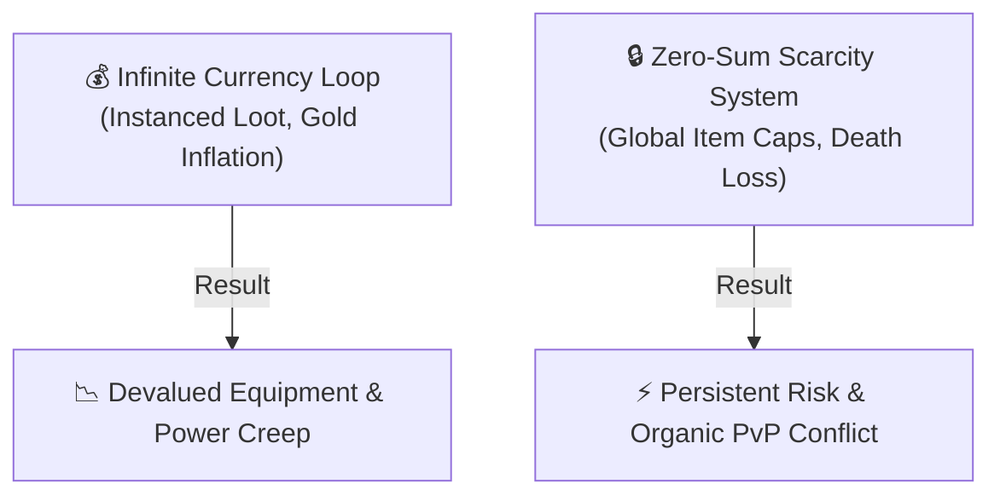

  

# 🎲 RPG Dynamics Lab 3: Zero-Sum Scarcity & Item Competition

  
    🏷️ College Game Design: System Dynamics & Resource Scarcity
  
  
    🏷️ Game Studies: Zero-Sum Economics vs. Infinite Currency Loops
  

| Attribute | Details |
| :--- | :--- |
| **Target Audience** | Game Design, Game Economics, Systems Design, Ludology |
| **Duration** | 45-Minute Single Period (or Day 3 of 1-Week Unit) |
| **Prerequisites** | RPG Dynamics Lab 1 & Lab 2 |
| **Primary Reference** | MUME Equipment & Item Cap Rules |

---

## 🎯 1. Lab Overview & Objectives

Unlike mainstream MMORPGs that rely on infinite virtual currency printing and endlessly instanced raid loot, **MUME features no standard commercial economy**. Instead, MUME operates on **strict zero-sum resource scarcity**: high-tier weapons, armor, and legendary artifacts exist in strictly capped global quantities across Middle-earth.

In this lab, students analyze how hard item limits, permanent equipment loss upon death, and finite mob trophy pools force organic player competition and high-stakes risk-vs-reward decision making.

### Learning Outcomes
1. Contrast **infinite currency/instanced loot economies** (e.g., *World of Warcraft*) with **zero-sum finite scarcity systems** (MUME).
2. Analyze how global item caps (`max_exist`) force players into active territorial control and player-versus-player (PvP) conflict.
3. Calculate risk-vs-reward ratios for equipping rare gear vs. storing items safely in rent inn vaults.

---

## 💡 2. Core Theory Walkthrough: Infinite Inflation vs. Zero-Sum Scarcity

### The 3 Pillars of MUME Scarcity Design:

1. **Global Item Caps (`max_exist`):** Legendary items (such as elven blades or black-mail armor) have hard server caps (e.g., only 5 exist in the entire game world simultaneously). If all 5 are held by players, no mob will drop another until one is destroyed, lost, or rented away.
2. **Death Looting & Equipment Degradation:** Upon death, a character's corpse remains in the room holding all carried gear. Opposing faction players can freely loot these items. Furthermore, equipment suffers permanent condition wear when damaged.
3. **No Commercial Currency Inflation:** Gold is heavy and scarce; high-tier gear cannot be purchased from vendor stores, requiring players to hunt rare boss mobs or defeat enemy players in battle.

---

## 🧪 3. Guided Analysis Activity (20 Minutes)

::: info 🏰 Classroom Sandbox Note
Students review MUME item help files (`help rent`, `help equipment`) or inspect merchant shops in **Bree** to observe how item condition and weight limit purchasing power.
:::

### Step 1: Comparative Economy Audit
Fill out the comparative matrix contrasting commercial MMORPGs with MUME:

| Economic Dimension | Commercial MMORPGs (*WoW*, *FFXIV*) | MUME (Zero-Sum Scarcity) |
| :--- | :--- | :--- |
| **Loot Distribution** | Instanced boss drops for every group member. | Shared single corpse; global item caps apply. |
| **Death Penalty** | Minor durability repair fee at vendor. | Full equipment drop on corpse; enemy looting. |
| **Item Permanence** | Gear stays bound to character forever. | Items decay, break, or transfer to enemy players. |
| **Primary Conflict Driver** | Quest logs & artificial daily checklists. | **Competition for finite, non-renewable resources.** |

---

## 🚀 4. Independent Student Challenge ("The Quest")

**Design Analysis Assignment: The High-Tier Gear Dilemma**

Imagine a player acquires a rare **Black-Mail Shirt** (only 3 exist globally).
* Equipping it increases defense by 25%, drastically improving survival in PvP combat.
* However, if the player dies while wearing it, the item drops on their corpse and will be looted by the enemy faction.

Write a 250-word Game Design Critique addressing:
1. How does this zero-sum risk mechanic change player psychology compared to games where gear is permanently soulbound?
2. How does strict item scarcity generate player-driven quests and emergent territorial wars without scripted quest markers?

---

## 📝 5. Verification & Submission Requirements

Submit your completed comparative analysis:
1. **Comparative Economy Matrix:** Completed table contrasting infinite vs zero-sum systems.
2. **Resource Scarcity Essay:** (250+ words).

---

## 📥 Teacher Resource Download

  

    <h3 style="margin: 0; font-size: 1.1rem; color: var(--vp-c-brand-1);">📄 RPG Lab 3 Teacher Resource Pack</h3>
    
Includes printable game economy comparison worksheets, slide decks, discussion prompts, and grading rubrics.

  

  <a href="../student" class="vp-button brand" style="padding: 0.5rem 1.2rem; font-size: 0.9rem; text-decoration: none;">Download Teacher Pack 📥</a>

---

::: details 🔑 Teacher Answer Key & Assessment Rubric (Click to Expand)

### 10-Point Grading Rubric

| Criterion | Points | Description |
| :--- | :---: | :--- |
| **Economic Systems Matrix** | 4 pts | Accurate contrast between infinite currency inflation and zero-sum item caps. |
| **Risk-vs-Reward Analysis** | 3 pts | Insightful explanation of player psychology under permanent death looting penalties. |
| **Emergent Gameplay Insight** | 3 pts | Clear articulation of how item scarcity drives player-created narrative conflict. |

:::
