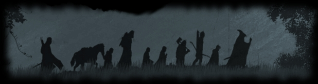
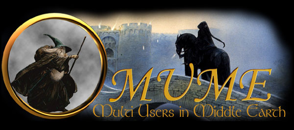

<i class="fa fa-quote-left" aria-hidden="true"></i>
You can trust us to stick to you through thick and thin&mdash;to the bitter end. You cannot trust us to let you face trouble alone, and go off without a word. We are your friends.
<i class="fa fa-quote-right" aria-hidden="true"></i>
 
<cite>&mdash; J.R.R. Tolkien, The Fellowship of the Ring</cite>

Ready to explore Middle-earth?

<a href="https://mume.org/play/">Play Now</a>

<h1>Join the Community</h1>

<section class="community-section">
<h2><i class="fa fa-comments" aria-hidden="true"></i> Real-time Chat</h2>

Our Discord server is the most active place for players to chat, find help, and coordinate adventures.

<iframe src="https://discord.com/widget?id=497457567392333824&theme=dark" width="100%" height="400" allowtransparency="true" frameborder="0" sandbox="allow-popups allow-popups-to-escape-sandbox allow-same-origin allow-scripts"></iframe>

<a href="https://discord.gg/XkZN55am9a" target="_blank" rel="noopener" class="read-more">Join Discord <i class="fa fa-external-link" aria-hidden="true"></i></a>

</section>

<section class="community-section">
<h2><i class="fa fa-book" aria-hidden="true"></i> MUME Wiki</h2>

<h3>Knowledge Base</h3>

The official Wiki contains tips, hints, and all sorts of useful information for newcomers and veterans alike.

<a href="https://docs.mume.org/wiki/" target="_self" rel="external" class="read-more">Visit the Wiki <i class="fa fa-external-link" aria-hidden="true"></i></a>

</section>

<section class="community-section">
<h2><i class="fa fa-youtube-play" aria-hidden="true"></i> Community Media</h2>

<iframe width="100%" height="315" src="https://www.youtube.com/embed/videoseries?list=UUM5T_xZJS1hiEc6Tq1GMhdw" frameborder="0" allow="accelerometer; autoplay; clipboard-write; encrypted-media; gyroscope; picture-in-picture" allowfullscreen></iframe>

Check out the community YouTube channel for combat logs, guides, and Middle-earth highlights.

<a href="https://www.youtube.com/user/Radagastthe1st" target="_blank" rel="noopener" class="read-more">Watch on YouTube <i class="fa fa-external-link" aria-hidden="true"></i></a>

</section>

<section class="community-section">
<h2><i class="fa fa-history" aria-hidden="true"></i> Elvenrunes</h2>

<h3>Combat Logs & Discussion</h3>

A long-standing pillar of the community, Elvenrunes features combat logs, forums, and character discussions.

<a href="https://elvenrunes.com" target="_blank" rel="noopener" class="read-more">Visit Elvenrunes <i class="fa fa-external-link" aria-hidden="true"></i></a>

</section>

<section class="community-section">
<h2><i class="fa fa-users" aria-hidden="true"></i> Player Interviews</h2>

<h3>Legends of MUME</h3>

Read interviews with legendary players and developers. Learn about the history and the people behind the game.

<a href="./interviews">Read Interviews</a>

</section>

<section class="community-section">
<h2><i class="fa fa-code" aria-hidden="true"></i> Open Source</h2>

<h3>Community Projects</h3>

Discover player-developed tools like MMapper, Powwow, and more. All our projects are open for contribution.

<a href="./opensource">Explore Projects</a>

</section>

