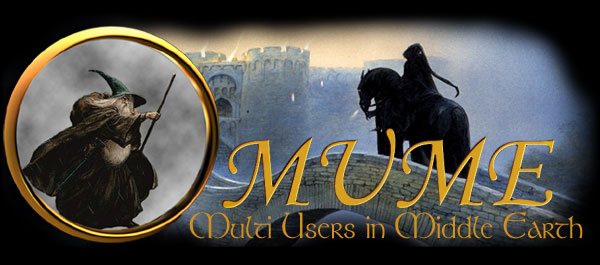
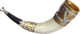
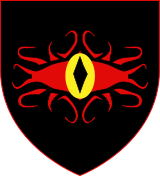
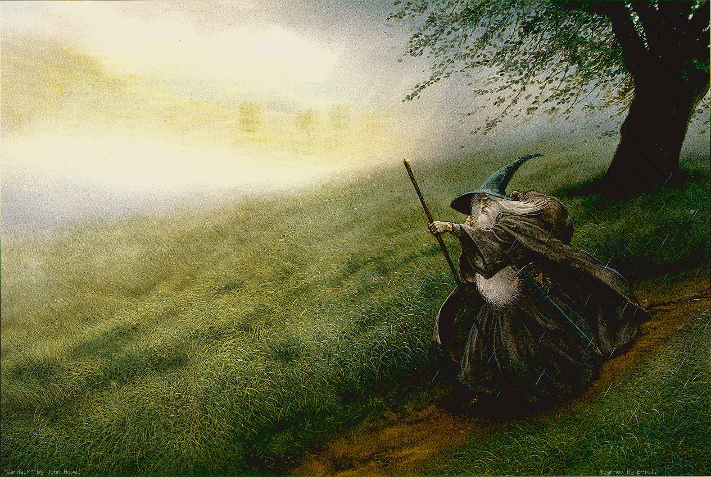

MUME, Multi-Users in Middle-earth, is a multiplayer text-based online game based upon J. R. R. Tolkien’s Middle-earth during the epic war between the forces of the Dark Lord and the armies of the Free peoples. MUME is completely at no cost to play and has been continuously running, expanded, and remastered by a community of volunteers since 1991.

MUME is a MUD, or retro MMORPG, that encourages players to role-play as they live in this meticulously crafted world exploring the conflict leading into the War of the Ring during the late Third Age. The action takes place nearly 100 years prior to The Hobbit but long after the loss of the One Ring by Sauron. The key to Erebor has just been found by Gandalf in Dol Guldur and all the epic tales narrated in The Lord of the Rings may take place.

Create your own hero: a Man, Hobbit, Elf, Dwarf, Orc, or Troll. Explore the Shire, Bree, Rivendell, the Grey Havens, the dark halls of Moria, the ruins of Ost-in-Edhil, and many other places. Join the battle between Good and Evil!

Ready to explore Middle-earth?

<a href="./play">Play Now</a>

<iframe width="100%" height="315" src="https://www.youtube.com/embed/d-Ax1MZlDoE" frameborder="0" allow="accelerometer; autoplay; clipboard-write; encrypted-media; gyroscope; picture-in-picture" allowfullscreen></iframe>

People think that Dark Souls was a hard game these days. Ha! You ain't seen nothing! … It was crazy in PvP … It was insane. Absolutely insane.
 
<cite>&mdash; TotalBiscuit, <a href="https://www.youtube.com/watch?v=1y9bS5cqLaM&feature=youtu.be&t=6m2s" target="_blank" rel="noopener">BBC 3 Interview</a></cite>

<h1>Latest News</h1>

<section class="community-section">

<h3>Re: Temporary Bugs Associated with Rogue AI Agent</h3>

Pilois, 02 Apr 2026

<a href="https://mume.org/news/latest" class="read-more">Read more</a>

</section>

<h1>Playable Races and Classes</h1>

<section class="community-section">

<h3>Armies of the West</h3>

<strong>Do you side with the Free Peoples of the West?</strong>

Choose from Men, Elves, Half-elves, Hobbits, and Dwarves to defend the Free People.

</section>

<section class="community-section">

<h3>Forces of the Dark Lord</h3>

<strong>Will you be a cunning and wicked villain?</strong>

Choose from Orcs, Trolls, and Black Númenóreans to hunt down and ruin the weak.

</section>

<section class="community-section">

<h3>Design Your Class</h3>

Shape your character any way you want by practicing skills or spells from any guild:

<ul>
  <li>Warrior</li>
  <li>Stealthy scout</li>
  <li>Master of magical arts</li>
  <li>Healer</li>
</ul>

Do you choose to be a ranger? A warmage? Endless possibilities are yours.

</section>

<section class="community-section">
<h2>Explore Middle-earth</h2>

<h3>Enter the Third Age</h3>

Visit an astonishing number of beautifully described locations:

<ul>
  <li>Enjoy an ale at Bree, wander the Shire, and explore Fornost</li>
  <li>Seek Elrond in Rivendell and brave the Trollshaws</li>
  <li>Get lost in Goblin-town, nestled deep in the Misty Mountains</li>
  <li>Pass through the Orc-infested Mines of Moria and enter fair Lothlórien</li>
  <li>Meet Ents in Fangorn Forest and explore Isengard or the Gap of Rohan</li>
  <li>Discover the growing shadow in Dol Guldur and Mirkwood</li>
</ul>
<a href="./about/features" class="read-more">Learn More</a>

</section>

<section class="community-section">
<h2>Slay Ancient Evils</h2>

<h3>Epic Challenges</h3>

There are older and fouler things than Orcs in the deep places of the world.

<ul>
  <li>Slay a Balrog by gathering a company of dwarves to take on Durin’s Bane</li>
  <li>Release the Wightlord of the Barrow-downs from his curse</li>
  <li>Brave a Kraken by taking on the Watcher in the Water</li>
  <li>Outsmart Bill, Bert, and Tom to avoid becoming lunch</li>
</ul>

</section>

<section class="community-section">
<h2>Acquire Legendary Artefacts</h2>

Find forgotten relics of awesome power from the First and Second Age.

<ul>
  <li>Wield Glamdring the Foe-hammer, Orcrist the Goblin-cleaver, and Sting</li>
  <li>Stab your foe with a Morgul-blade and watch them turn into a Wraith</li>
  <li>Use the Palantír of Amon Sûl to hunt down fresh meat</li>
  <li>Wear a shirt of shining mail, wrought from the finest mithril</li>
</ul>

</section>

<section class="community-section">
<h2>Hundreds of Achievements and Quests</h2>

Can you free Arda from all the sorrows that weigh upon it?

<ul>
  <li>Pacify unsavory characters like Bill Ferny and the corrupt Chief of Tharbad</li>
  <li>Befriend a lonely giant and learn how to bake delectable bannocks to feed the hungry</li>
  <li>Free a Silvan elf from certain death in the depths of Mirkwood Forest</li>
  <li>Follow in Celebrimbor's footsteps and forge Rings of Power at the ruins of Ost-in-Edhil</li>
</ul>

</section>

<section class="community-section">
<h2>Become the #1 Ranked Warlord</h2>

<h3>Player versus Player</h3>

Find adulation and glory by outwitting your opponents in a highly competitive world PvP.

<ul>
  <li>Track your opponent from afar to strike at the perfect time</li>
  <li>Pick locks or block doors to trap your foes</li>
  <li>Mix foetid poisons to envenom your foes</li>
</ul>

</section>

<section class="community-section">
<h2>Gamble it all to win</h2>

Experience the insane PvP rush as your character takes part in the war.

<ul>
  <li>Strip your opponents corpse clean by taking their gear as your own</li>
  <li>One mistype and you have lost hours of real time needed to re-gear</li>
  <li>Maintain your war points by keeping a high K/D ratio</li>
</ul>
<a href="https://mume.org/news/war" class="read-more">View War Status <i class="fa fa-external-link" aria-hidden="true"></i></a>

</section>

<section class="community-section">
<h2>Join the Community</h2>

<h3>Join the Ainur</h3>

Join the Istari, attain immortality, and take your place within the community to extend and enhance the game. Nerd out with Tolkien fans to expand MUME all the way to Mordor.

<a href="https://mume.org/about/ainur" class="read-more">Learn More <i class="fa fa-external-link" aria-hidden="true"></i></a>

</section>

Speak, friend, and enter

<a href="./play">Mellon</a>

