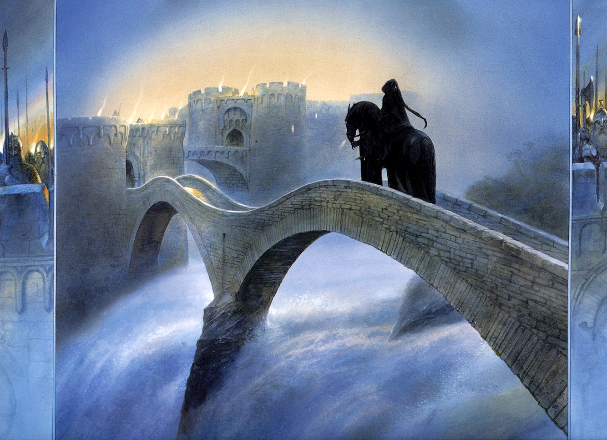
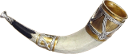
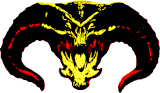
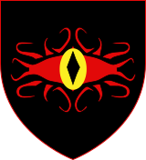

<h1>MUME Open Source</h1>

The MUME ecosystem is powered by its community. Many of the tools, clients, and resources used by players every day are open-source and developed by volunteers. We encourage everyone to contribute, whether by writing code, reporting bugs, or improving documentation.

<a href="https://github.com/mume" target="_blank" rel="noopener" class="read-more">Visit MUME on GitHub <i class="fa fa-github" aria-hidden="true"></i></a>

<h2>Featured Projects</h2>

<h3>MMapper</h3>

A graphical mapper for MUME. It helps you navigate the vast world of Middle-earth by providing a real-time map of your surroundings. Available for Windows, Linux, and macOS.

<a href="https://github.com/mume/mmapper" target="_blank" rel="noopener">View on GitHub <i class="fa fa-github" aria-hidden="true"></i></a>

<h3>Powwow</h3>

A powerful, extensible client for MUME. It features a robust scripting engine, customizable UI, and built-in support for many MUME-specific features.

<a href="https://github.com/mume/powwow" target="_blank" rel="noopener">View on GitHub <i class="fa fa-github" aria-hidden="true"></i></a>

<h3>PowTTY</h3>

A terminal-based client for MUME, optimized for speed and reliability. It's a great choice for players who prefer a traditional MUDding experience.

<a href="https://github.com/mume/powtty" target="_blank" rel="noopener">View on GitHub <i class="fa fa-github" aria-hidden="true"></i></a>

<h3>Play MUME</h3>

A modern web-based client for MUME using DecafMUD. Perfect for new players or those who want to jump in quickly without installing any software.

<a href="https://github.com/mume/play-mume" target="_blank" rel="noopener">View on GitHub <i class="fa fa-github" aria-hidden="true"></i></a>

<h3>MUSHclient-MUME</h3>

A collection of MushClient scripts and plugins for MUME, including features for accessibility (NVDA support) and automated tasks like enchanting.

<a href="https://github.com/mume/mushclient-mume" target="_blank" rel="noopener">View on GitHub <i class="fa fa-github" aria-hidden="true"></i></a>

<h2>How to Get Involved</h2>

<h3>Contribute Code</h3>

Most of our projects are hosted on GitHub. If you're a developer, you can help by picking up open issues, suggesting new features, or optimizing existing code.

<h3>Documentation & Testing</h3>

Not a coder? You can still help! Testing new releases, writing guides, and reporting bugs are invaluable contributions to the community.

