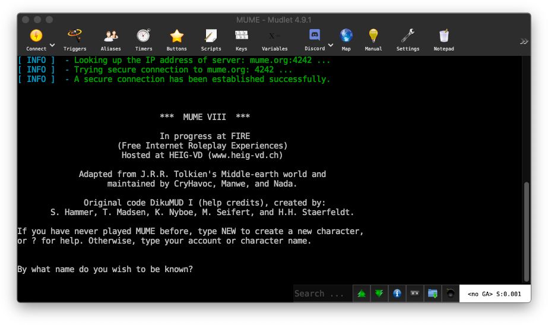

# Playing MUME!

MUME is a complex and rich text-based game with an incredibly hard learning curve. If you learn the commands and features, your life may be fulfilling and rewarding; otherwise, it may be frustratingly short!

We strongly recommend that you browse the [newcomers page](./resources/newcomers) for important survival information before you start playing. That being said, the information is also available in-game, so feel free to jump on in.

There are three ways to join the battle for Middle-earth:

*   **A.** [Using your browser](#a-play-with-mmapper-web-recommended)
*   **B.** [Using MMapper Desktop](#b-play-with-mmapper-desktop-powerful)
*   **C.** [Using a MUD client](#c-using-a-mud-client-retro)

## A. Play with MMapper Web (Recommended)

The web client is the least friction option, recommended if you want to get a quick feel of the game. You get the full power of a real-time map with no installation required. Also, it should work from most corporate, library, and school networks.

[**Play with MMapper Web**](https://mume.org/play/browser){target="_self" rel="external"}

For incompatible or older browsers, you can also try <a href="https://mume.org/play/browser-legacy" target="_self" rel="external">this web client</a>.

## B. Play with MMapper Desktop (Powerful)

MMapper is the most powerful option that 95% of our playerbase uses. This option requires installing and configuring software on your computer. MMapper is a community developed, open source MUME game client that helps you navigate by showing your current position within Middle-earth on a map.

[**Download MMapper Desktop**](https://mume.github.io/MMapper/)

## C. Using a MUD client (Retro)

MUME was originally intended to be played using telnet or a MUD client. There was no visual map to aid you and players would map out the world in their head or draw it down on paper. This option is retro and the least popular option.

If you already have a MUD client, just connect to **mume.org** port **4242** and you are ready to go.

[**Download Mudlet**](https://www.mudlet.org/)

For alternatives, check out our [clients list](https://mume.org/help/clients){target="_self" rel="external"} and [mappers page](https://mume.org/help/mappers){target="_self" rel="external"}. You may also find legacy clients at our [mirror](https://mume.org/download/clients/){target="_self" rel="external"}.
