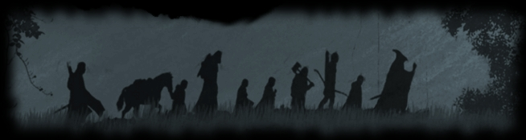
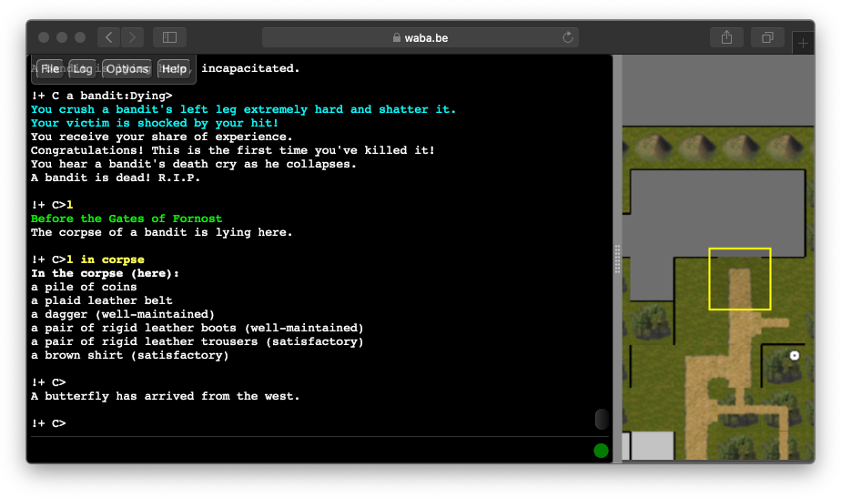

  

# Play MUME in your web browser! (Legacy)

These are legacy web clients.
Unless you have a specific need for them, please use our <a href="./">modern web client</a>.

Choose a legacy client to launch in your browser:

* <a href="../play-mume/" target="_self" rel="external">DecafMUD</a> (2017) - HTML5/Javascript
* <a href="./mumejc/">MUMEjc</a> (2013) - Requires Java 7+
* <a href="./mudjc/">MUDjc</a> (1999) - Requires Java

  <a href="../play-mume/" target="_self" rel="external">Play with DecafMUD</a>

  

If the Java clients won't work for you, remember you can still play MUME via plain telnet or by downloading a stand-alone client.
