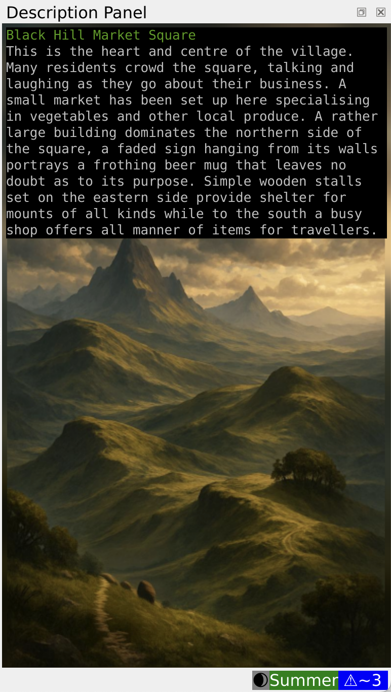
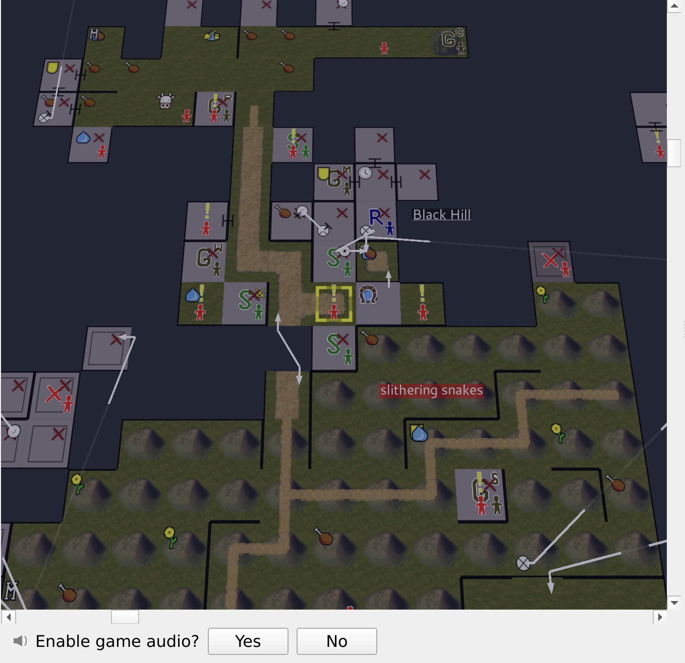

# Chapter 15: Hero's Graduation

Congratulations on guiding Fuor through the Black Hills walkthrough! You have mastered navigation, combat reflexes, equipment, trading, and resting.

### Web Client & MMapper Preview

When you launch into MUME using the Web Client, you'll see an integrated live mapper (**MMapper**) and character stats panel:

  
  

Follow the interactive quest prompts below to complete your graduation!
